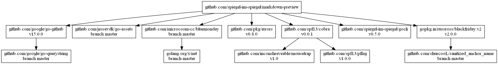

# [markdown-preview] - Markdown Preview Tool

[](https://travis-ci.org/spiegel-im-spiegel/markdown-preview)
[](https://raw.githubusercontent.com/spiegel-im-spiegel/markdown-preview/master/LICENSE)
[](https://github.com/spiegel-im-spiegel/markdown-preview/releases/latest)

[markdown-preview]: https://github.com/spiegel-im-spiegel/markdown-preview "spiegel-im-spiegel/markdown-preview: Markdown Preview Tool"

## Binaries

See [latest release](https://github.com/spiegel-im-spiegel/markdown-preview/releases/latest).

## Usage

### Processing Markdown

```
$ markdown-preview proc -h
Processing Markdown

Usage:
  markdown-preview proc [flags] [markdown file]

Flags:
  -c, --css string      CSS file URL (with --page option)
  -g, --github          use GitHub Markdown API
  -h, --help            help for proc
  -l, --line-break      translate newlines into line breaks
  -o, --output string   output file path
  -p, --page            generate a complete HTML page
  -s, --sanitize        sanitize untrusted content
```

## Dependencies

```
dep status -dot | dot -Tpng -o dependency.png
```

[](dependency.png)

## Bookmark

- [Markdown | GitHub Developer Guide](https://developer.github.com/v3/markdown/)
